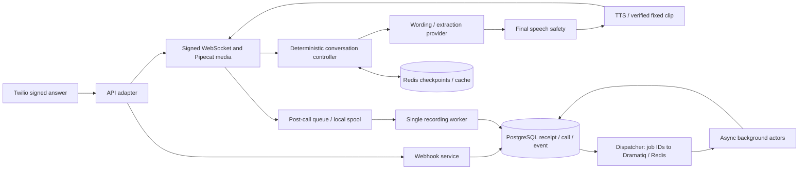

# Architecture and module ownership

**Present:** layered Python modular monolith with Twilio/Pipecat cloud media, Redis, PostgreSQL/Alembic, atomic answer acceptance and durable Dramatiq job processing. **Target:** validated local AI, complete transactional live booking, governed retrieval and production access/telemetry/deployment controls.

The diagram shows current ownership. It does not show a committed appointment on the live conversation path: the controller still uses the static/read-only calendar. [Level 3](levels/level-03.md) completes that integration. Local providers/RAG are future additions to the same boundaries.

## Dependencies

| Layer | Responsibility / source |
|---|---|
| Composition | `roma/main.py` wires settings, database, services, media and routes |
| API | `roma/api/v1/` parses/authenticates and maps responses; current URLs remain unversioned |
| Services | Call, webhook, post-call and dispatcher use cases |
| Domain | Conversation, appointment time resolution, safety, cost and persistence contracts |
| Repositories | PostgreSQL units of work/records and Redis transient adapters |
| Providers | Twilio, calendar and Dramatiq SDK boundaries; local model contracts added at L1–5 |
| Realtime | Pipecat processors, endpointing, streaming/cancellation, recorder and safe speech |
| Workers | Recording finalization and database-authoritative background effects |

Dependencies point inward toward domain rules. Do not move SDKs, FastAPI or SQL into the conversation policy merely to connect a feature. Retain the existing layered `roma/` package.

## Transaction boundaries

`/answer` commits receipt/call/event before successful TwiML; failure is 503. Post-call handling commits call/job intents before recording-queue ack. Background actors commit their effect and settlement together. The booking repository locks an existing slot and has active-slot uniqueness, but needs live use-case/API integration.

A short booking transaction can run in the turn; inference, audio, external sync and recording conversion cannot hold it open. PostgreSQL sessions are short-lived and process pool totals must remain within the database budget.

## Relational foundations

The [schema catalog](20-relational-schema.md) owns the physical table/key/constraint/index and retention rationale. L1 section 4 adds checkpoint and model/benchmark evidence models; these tables are not yet live pipeline consumers. The additive migration preserves old keys/semantics and adds optional turn-language metadata. L1 section 5 adds the [migration workflow](21-database-migrations.md) and separate opt-in demo seeds; migration/seeding tools depend only on database settings and never initialize voice providers.

## Deployment and target

Keep Twilio and the existing Pipecat comparison profile. Direct local inference precedes model serving; embeddings/pgvector arrive with conditional RAG at L9. Final local production permits carrier/internal services while using zero external GenAI APIs.

Existing Compose is pre-v4 infrastructure tooling, not proof of Level 13. No production host/GPU/SLO is established by these docs. Replica growth requires measured capacity, shared coordination and route/auth checks; recording startup recovery currently supports one recording consumer. See [state](06-state-and-cache.md), [concurrency](08-concurrency.md) and [decisions](decisions.md).
