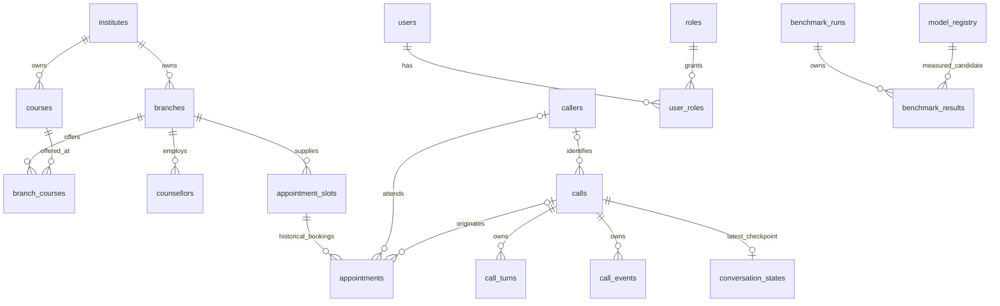

# Relational schema and key rationale

**Level 1 section 4.** This catalog describes the current 25-table PostgreSQL metadata and additive migration `20261004_0003`. Existing definitions, indexes and applied migrations are preserved; `call_turns.language` is the only additive column on an old table. No existing values are guessed/backfilled. `knowledge_documents`, `knowledge_chunks` and `retrieval_logs` remain Level 9, including pgvector.

## Relationships and ownership

The diagram shows major associations; the catalog below lists every actual FK. Historical appointment rows may share a slot; only one `booked`/`confirmed` row may be active. A positive slot capacity does not enable multiple active appointments under the preserved partial unique index.

## Design rules and compatibility

Every entity uses a PostgreSQL-generated opaque UUID primary key; these avoid treating phone numbers, names or mutable provider labels as database identity. Relationship tables use composite UUID primary keys so membership pairs cannot repeat. Primary/unique constraints supply their own B-tree indexes; do not add redundant indexes on the same leading keys. New child-FK lookup coverage is supplied by `conversation_states.call_id` uniqueness and benchmark result run/model-leading indexes.

Named checks reject invalid values at the database boundary; checks that allow NULL are paired with nullability choices. UTC-aware timestamps represent events, while appointment date/time remains branch-local business data with an explicit branch timezone. Financial values remain Decimal/Numeric. Benchmark values use finite `Numeric(20,8)` and may be signed; metric-specific ranges/units, sample aggregation and dataset approval belong to a future runner. A successful run needs positive samples and start/end timestamps; failure/cancellation before execution may have only an end timestamp.

`call_turns.language` is optional observed/input-language metadata. Unknown historic language stays NULL; it does not switch the Hindi-base Hinglish reply policy. Existing safety `rule` stores the rule identifier; the roadmap example `rule_id` does not require a rename, duplicate column or invented rule table. Audit resource IDs are polymorphic references, not enforced multi-table FKs. Existing safety/usage call/turn associations are independent optional FKs; matching-call validation remains an application concern and is not newly claimed as a database guarantee.

`conversation_states` is one latest checkpoint, not an appointment reservation or a full event log. Positive revision/schema, policy identity, stage and object state provide a foundation; the L2/L7 writer must implement compare-and-swap, schema/content validation, expiry refusal, compatible restore and current appointment checks. No checkpoint writer/restore is enabled by this schema increment. Do not keep sessions open during inference/audio.

Model rows describe candidate versions rather than deploying models. Future producers must insert a new version row for changed provenance, avoid editing identity/artifact fields once measured, validate license/source/hash identity and exclude credentials/signed URLs from artifact references. FKs prevent orphan results and deletion of measured model rows; they do not enforce identity-field immutability or confer model approval. Future runners must preserve corpus/config/hardware/cold-warm identity, pin exact local artifacts and keep raw samples, caller transcripts and PII out of benchmark JSON. Partial failed-run results may exist; comparison/reporting must select eligible completed runs.

## Retention and deletion choices

| Records | Current choice and limit |
|---|---|
| Caller/call/turn, safety/usage/cost/audit and job evidence | Preserve existing nullable retention/redaction fields. NULL is unresolved/unassigned policy, not permission for indefinite production retention. Full cleanup/access/backup policy is L8 and owner-approved. |
| Call events | Call-owned metadata; parent deletion cascades. Payload PII minimization belongs to the producer; no standalone expiry column is invented. |
| Conversation checkpoints | Require an explicit `retention_until > created_at`, without a guessed duration/default. Call deletion cascades. Expiry does not delete rows automatically; restore refusal/cleanup are pending consumers. |
| Recording references | Existing required expiry, consent/redaction/status and call ownership. Cascading SQL deletion removes metadata only; object/spool/backup deletion is a coordinated privacy workflow. |
| Webhook receipts | Retained independently of calls so expired call records cannot be recreated by callback replay. Minimized identity/digest; replay-window policy remains a separate gate. |
| Model registry | Non-PII provenance, kept while referenced by results; use deactivation to stop candidate selection. Removing a measured model is blocked. |
| Benchmark runs/results | Non-PII metadata; optional run expiry allows an explicit evidence-retention decision. Run deletion cascades results; remaining model provenance survives. No raw benchmark media/text is stored here. |
| Organization, users/roles and memberships | Preserve activity/deletion/reference behavior; deactivate referenced masters and use approved identity cleanup rather than broad cascades. |
| Slots/appointments | Preserve business history and one-active-booking rule; cancellation/release must be atomic at L3, not inferred from Redis/checkpoint JSON. |

No automatic purge task, login/RBAC, local inference, benchmark executor, recording-retention approval or live booking integration is added by creating these tables. Existing SQL defaults/checks are retained even where stronger future policy needs an additive migration. No arbitrary wall-clock expiry check uses `now()`; expiry remains a consumer/cleanup decision.

## Complete table/key/constraint/index catalog

The expressions below are from current SQLAlchemy metadata. They define row-level database guarantees; each unique/index entry explains its business identity or query. Existing indexes are retained, not claimed newly measured as optimal. Review real query plans before adding or dropping an index.

### `callers`

Pseudonymous caller identity and approved counselling attributes.

Columns: `phone_hash`, `name` (nullable), `preferred_language` (nullable), `city` (nullable), `education` (nullable), `current_status` (nullable), `anonymized_at` (nullable), `retention_until` (nullable), `id`, `created_at`, `updated_at`.

- PK `pk_callers` on `id`: Opaque durable entity identity, generated with `gen_random_uuid()`.
- Unique `uq_callers_phone_hash` on `phone_hash`: One pseudonymous identity per canonical secret-bound phone digest.

### `institutes`

Institute business reference; code is its stable natural identifier.

Columns: `code`, `name`, `is_active`, `id`, `created_at`, `updated_at`.

- PK `pk_institutes` on `id`: Opaque durable entity identity, generated with `gen_random_uuid()`.
- Unique `uq_institutes_code` on `code`: One institute for a business code.

### `branches`

Institute-scoped branch identity, city and visiting timezone.

Columns: `institute_id`, `code`, `name`, `city`, `timezone`, `is_active`, `id`, `created_at`, `updated_at`.

- PK `pk_branches` on `id`: Opaque durable entity identity, generated with `gen_random_uuid()`.
- FK `fk_branches_institute_id_institutes`: `institute_id` → `institutes.id`, `RESTRICT`. Parent must exist. Reject deleting a referenced business/provenance row; deactivate or clear owned dependents through an explicit workflow.
- Unique `uq_branches_institute_id_code` on `institute_id,code`: Branch codes may repeat across institutes but not within one institute.
- Index `ix_branches_institute_id_is_active` on `institute_id,is_active`: List eligible branches within an institute.

### `courses`

Institute-scoped course identity and approved description.

Columns: `institute_id`, `code`, `name`, `description` (nullable), `is_active`, `id`, `created_at`, `updated_at`.

- PK `pk_courses` on `id`: Opaque durable entity identity, generated with `gen_random_uuid()`.
- FK `fk_courses_institute_id_institutes`: `institute_id` → `institutes.id`, `RESTRICT`. Parent must exist. Reject deleting a referenced business/provenance row; deactivate or clear owned dependents through an explicit workflow.
- Unique `uq_courses_institute_id_code` on `institute_id,code`: Course codes are scoped to the owning institute.
- Index `ix_courses_institute_id_is_active` on `institute_id,is_active`: List eligible courses within an institute.

### `branch_courses`

Normalized many-to-many course offering; a branch/course pair exists once.

Columns: `branch_id`, `course_id`.

- PK `pk_branch_courses` on `branch_id, course_id`: Pair membership identity; no duplicate relationship rows.
- FK `fk_branch_courses_branch_id_branches`: `branch_id` → `branches.id`, `RESTRICT`. Parent must exist. Reject deleting a referenced business/provenance row; deactivate or clear owned dependents through an explicit workflow.
- FK `fk_branch_courses_course_id_courses`: `course_id` → `courses.id`, `RESTRICT`. Parent must exist. Reject deleting a referenced business/provenance row; deactivate or clear owned dependents through an explicit workflow.

### `counsellors`

Branch-scoped staff identity, optionally linked one-to-one to a backend user.

Columns: `branch_id`, `user_id` (nullable), `employee_code`, `display_name`, `is_active`, `id`, `created_at`, `updated_at`.

- PK `pk_counsellors` on `id`: Opaque durable entity identity, generated with `gen_random_uuid()`.
- FK `fk_counsellors_branch_id_branches`: `branch_id` → `branches.id`, `RESTRICT`. Parent must exist. Reject deleting a referenced business/provenance row; deactivate or clear owned dependents through an explicit workflow.
- FK `fk_counsellors_user_id_users`: `user_id` → `users.id`, `RESTRICT`. Parent must exist. Reject deleting a referenced business/provenance row; deactivate or clear owned dependents through an explicit workflow.
- Unique `uq_counsellors_branch_id_employee_code` on `branch_id,employee_code`: Staff codes are unique within a branch.
- Unique `uq_counsellors_user_id` on `user_id`: A linked user identifies at most one counsellor; NULL permits unlinked staff.
- Index `ix_counsellors_branch_id_is_active` on `branch_id,is_active`: Find eligible staff for a branch.

### `calls`

Durable carrier/lifecycle record with optional caller association and summarized outcome.

Columns: `caller_id` (nullable), `provider_call_id` (nullable), `direction`, `status`, `language` (nullable), `started_at`, `answered_at` (nullable), `ended_at` (nullable), `final_stage` (nullable), `booking_status` (nullable), `total_cost` (nullable), `currency` (nullable), `recording_url` (nullable), `retention_until` (nullable), `deleted_at` (nullable), `id`, `created_at`, `updated_at`.

- PK `pk_calls` on `id`: Opaque durable entity identity, generated with `gen_random_uuid()`.
- Check `ck_calls_currency_length`: `char_length(currency) = 3`. Enforces the named row invariant before commit.
- Check `ck_calls_direction`: `direction IN ('inbound', 'outbound')`. Enforces the named row invariant before commit.
- Check `ck_calls_status`: `status IN ('pending', 'ringing', 'in_progress', 'completed', 'failed', 'cancelled', 'no_answer', 'busy')`. Enforces the named row invariant before commit.
- Check `ck_calls_total_cost_nonnegative`: `total_cost >= 0`. Enforces the named row invariant before commit.
- FK `fk_calls_caller_id_callers`: `caller_id` → `callers.id`, `SET NULL`. Parent must exist. Keep historical evidence while allowing removal/anonymization of the optional association.
- Unique `uq_calls_provider_call_id` on `provider_call_id`: Deduplicate carrier calls; NULL permits pre-carrier records.
- Index `ix_calls_caller_id_created_at` on `caller_id,created_at`: Browse caller history chronologically.
- Index `ix_calls_started_at` on `started_at`: Bound call-history queries by time window.
- Index `ix_calls_status_created_at` on `status,created_at`: Filter lifecycle records and order by creation time.

### `call_turns`

Ordered per-call utterance metadata; transcript is optional and independently redactable.

Columns: `call_id`, `turn_number`, `speaker`, `transcript` (nullable), `conversation_stage` (nullable), `language` (nullable), `route` (nullable), `latency_ms` (nullable), `retention_until` (nullable), `transcript_deleted_at` (nullable), `id`, `created_at`.

- PK `pk_call_turns` on `id`: Opaque durable entity identity, generated with `gen_random_uuid()`.
- Check `ck_call_turns_latency_ms_nonnegative`: `latency_ms >= 0`. Enforces the named row invariant before commit.
- Check `ck_call_turns_speaker`: `speaker IN ('caller', 'agent', 'system')`. Enforces the named row invariant before commit.
- Check `ck_call_turns_turn_number_positive`: `turn_number > 0`. Enforces the named row invariant before commit.
- FK `fk_call_turns_call_id_calls`: `call_id` → `calls.id`, `CASCADE`. Parent must exist. Owned dependent rows cannot outlive this parent; deleting metadata does not delete external files.
- Unique `uq_call_turns_call_id_turn_number` on `call_id,turn_number`: A turn number has one owner within a call; other calls may reuse the number.
- Index `ix_call_turns_call_id_created_at` on `call_id,created_at`: Fetch a call narrative in chronological order.

### `call_events`

Call-scoped event history with optional deduplication key.

Columns: `call_id`, `event_type`, `conversation_stage` (nullable), `payload`, `occurred_at`, `idempotency_key` (nullable), `id`.

- PK `pk_call_events` on `id`: Opaque durable entity identity, generated with `gen_random_uuid()`.
- FK `fk_call_events_call_id_calls`: `call_id` → `calls.id`, `CASCADE`. Parent must exist. Owned dependent rows cannot outlive this parent; deleting metadata does not delete external files.
- Unique `uq_call_events_idempotency_key` on `idempotency_key`: Deduplicate keyed appends; NULL permits intentionally unkeyed events.
- Index `ix_call_events_call_id_occurred_at` on `call_id,occurred_at`: Read a call event timeline.

### `conversation_states`

One latest durable checkpoint per call; schema/revision/policy identity and approved expiry.

Columns: `call_id`, `schema_version`, `revision`, `policy_version`, `conversation_stage`, `state`, `retention_until`, `id`, `created_at`, `updated_at`.

- PK `pk_conversation_states` on `id`: Opaque durable entity identity, generated with `gen_random_uuid()`.
- Check `ck_conversation_states_conversation_stage`: `conversation_stage IN ('open', 'discover', 'value', 'structure', 'pivot', 'objection', 'close')`. Enforces the named row invariant before commit.
- Check `ck_conversation_states_policy_version_nonblank`: `btrim(policy_version) <> ''`. Enforces the named row invariant before commit.
- Check `ck_conversation_states_retention_after_creation`: `retention_until > created_at`. Enforces the named row invariant before commit.
- Check `ck_conversation_states_revision_positive`: `revision > 0`. Enforces the named row invariant before commit.
- Check `ck_conversation_states_schema_version_positive`: `schema_version > 0`. Enforces the named row invariant before commit.
- Check `ck_conversation_states_state_object`: `jsonb_typeof(state) = 'object'`. Enforces the named row invariant before commit.
- FK `fk_conversation_states_call_id_calls`: `call_id` → `calls.id`, `CASCADE`. Parent must exist. Owned dependent rows cannot outlive this parent; deleting metadata does not delete external files.
- Unique `uq_conversation_states_call_id` on `call_id`: Only one current checkpoint per call, and its lookup/FK has a leading unique index.
- Index `ix_conversation_states_retention_until` on `retention_until`: Find checkpoints due for expiry cleanup without scanning state JSON.

### `appointment_slots`

Normalized branch/date/time supply; active booking remains limited to one.

Columns: `branch_id`, `appointment_date`, `start_time`, `end_time`, `capacity`, `status`, `id`, `created_at`, `updated_at`.

- PK `pk_appointment_slots` on `id`: Opaque durable entity identity, generated with `gen_random_uuid()`.
- Check `ck_appointment_slots_capacity_positive`: `capacity > 0`. Enforces the named row invariant before commit.
- Check `ck_appointment_slots_status`: `status IN ('available', 'held', 'booked', 'blocked', 'cancelled')`. Enforces the named row invariant before commit.
- Check `ck_appointment_slots_time_order`: `end_time > start_time`. Enforces the named row invariant before commit.
- FK `fk_appointment_slots_branch_id_branches`: `branch_id` → `branches.id`, `RESTRICT`. Parent must exist. Reject deleting a referenced business/provenance row; deactivate or clear owned dependents through an explicit workflow.
- Unique `uq_appointment_slots_branch_id_appointment_date_start_time` on `branch_id,appointment_date,start_time`: One supply row for a branch/date/start tuple.
- Index `ix_appointment_slots_branch_id_appointment_date_status_start_time` on `branch_id,appointment_date,status,start_time`: Find offerable supply for a branch/day/status, ordered by time.

### `appointments`

Historical appointment facts; partial uniqueness prevents multiple active bookings.

Columns: `caller_id` (nullable), `call_id` (nullable), `branch_id`, `appointment_date`, `start_time`, `counsellor_id` (nullable), `course_id` (nullable), `status`, `retention_until` (nullable), `anonymized_at` (nullable), `id`, `created_at`, `updated_at`.

- PK `pk_appointments` on `id`: Opaque durable entity identity, generated with `gen_random_uuid()`.
- Check `ck_appointments_status`: `status IN ('booked', 'confirmed', 'completed', 'cancelled', 'no_show')`. Enforces the named row invariant before commit.
- FK `fk_appointments_branch_id_appointment_date_start_time_appointment_slots`: `branch_id,appointment_date,start_time` → `appointment_slots.branch_id,appointment_slots.appointment_date,appointment_slots.start_time`, `RESTRICT`. Parent must exist. Reject deleting a referenced business/provenance row; deactivate or clear owned dependents through an explicit workflow.
- FK `fk_appointments_call_id_calls`: `call_id` → `calls.id`, `SET NULL`. Parent must exist. Keep historical evidence while allowing removal/anonymization of the optional association.
- FK `fk_appointments_caller_id_callers`: `caller_id` → `callers.id`, `SET NULL`. Parent must exist. Keep historical evidence while allowing removal/anonymization of the optional association.
- FK `fk_appointments_counsellor_id_counsellors`: `counsellor_id` → `counsellors.id`, `SET NULL`. Parent must exist. Keep historical evidence while allowing removal/anonymization of the optional association.
- FK `fk_appointments_course_id_courses`: `course_id` → `courses.id`, `SET NULL`. Parent must exist. Keep historical evidence while allowing removal/anonymization of the optional association.
- Index `ix_appointments_branch_id_appointment_date_status` on `branch_id,appointment_date,status`: List a branch/day schedule by appointment status.
- Index `ix_appointments_caller_id_appointment_date` on `caller_id,appointment_date`: Read a caller appointment history/upcoming visits.
- Unique index `uq_appointments_active_slot` on `branch_id,appointment_date,start_time`: Enforce one booked/confirmed appointment per slot; cancelled/completed history is excluded. Predicate: `status IN ('booked', 'confirmed')`.

### `safety_events`

Rule/category/substitution evidence, optionally linked to a call and turn.

Columns: `call_id` (nullable), `turn_id` (nullable), `rule` (nullable), `original_category` (nullable), `replacement_type` (nullable), `metadata`, `retention_until` (nullable), `deleted_at` (nullable), `id`, `created_at`.

- PK `pk_safety_events` on `id`: Opaque durable entity identity, generated with `gen_random_uuid()`.
- FK `fk_safety_events_call_id_calls`: `call_id` → `calls.id`, `SET NULL`. Parent must exist. Keep historical evidence while allowing removal/anonymization of the optional association.
- FK `fk_safety_events_turn_id_call_turns`: `turn_id` → `call_turns.id`, `SET NULL`. Parent must exist. Keep historical evidence while allowing removal/anonymization of the optional association.
- Index `ix_safety_events_call_id_created_at` on `call_id,created_at`: Review a call safety timeline.
- Index `ix_safety_events_rule_created_at` on `rule,created_at`: Review rule-specific incidents over time.

### `provider_usage`

Deduplicated measured provider units, separated from a price calculation.

Columns: `call_id` (nullable), `turn_id` (nullable), `provider`, `service`, `model` (nullable), `measured_units`, `unit_name`, `provider_metadata`, `occurred_at`, `idempotency_key`, `retention_until` (nullable), `id`.

- PK `pk_provider_usage` on `id`: Opaque durable entity identity, generated with `gen_random_uuid()`.
- Check `ck_provider_usage_measured_units_nonnegative`: `measured_units >= 0`. Enforces the named row invariant before commit.
- Check `ck_provider_usage_service`: `service IN ('telephony', 'stt', 'llm', 'tts')`. Enforces the named row invariant before commit.
- FK `fk_provider_usage_call_id_calls`: `call_id` → `calls.id`, `SET NULL`. Parent must exist. Keep historical evidence while allowing removal/anonymization of the optional association.
- FK `fk_provider_usage_turn_id_call_turns`: `turn_id` → `call_turns.id`, `SET NULL`. Parent must exist. Keep historical evidence while allowing removal/anonymization of the optional association.
- Unique `uq_provider_usage_idempotency_key` on `idempotency_key`: One metering fact per provider-operation identity.
- Index `ix_provider_usage_call_id_service_occurred_at` on `call_id,service,occurred_at`: Reconcile measured usage by call/service/time.
- Index `ix_provider_usage_provider_service_occurred_at` on `provider,service,occurred_at`: Aggregate provider usage by service/time.

### `call_costs`

Deduplicated priced ledger rows with Decimal amounts and pricing identity.

Columns: `call_id` (nullable), `provider_usage_id` (nullable), `provider`, `service`, `model` (nullable), `quantity`, `unit`, `unit_price`, `amount`, `currency`, `pricing_version`, `metadata`, `occurred_at`, `idempotency_key`, `retention_until` (nullable), `id`.

- PK `pk_call_costs` on `id`: Opaque durable entity identity, generated with `gen_random_uuid()`.
- Check `ck_call_costs_amount_nonnegative`: `amount >= 0`. Enforces the named row invariant before commit.
- Check `ck_call_costs_currency_length`: `char_length(currency) = 3`. Enforces the named row invariant before commit.
- Check `ck_call_costs_quantity_nonnegative`: `quantity >= 0`. Enforces the named row invariant before commit.
- Check `ck_call_costs_unit_price_nonnegative`: `unit_price >= 0`. Enforces the named row invariant before commit.
- FK `fk_call_costs_call_id_calls`: `call_id` → `calls.id`, `SET NULL`. Parent must exist. Keep historical evidence while allowing removal/anonymization of the optional association.
- FK `fk_call_costs_provider_usage_id_provider_usage`: `provider_usage_id` → `provider_usage.id`, `SET NULL`. Parent must exist. Keep historical evidence while allowing removal/anonymization of the optional association.
- Unique `uq_call_costs_idempotency_key` on `idempotency_key`: One priced posting per billing identity; retries cannot double-post.
- Index `ix_call_costs_call_id_occurred_at` on `call_id,occurred_at`: Reconcile a call priced ledger.
- Index `ix_call_costs_provider_service_occurred_at` on `provider,service,occurred_at`: Aggregate spending by provider/service/time.

### `recordings`

Protected object reference, consent/checksum/status and explicit retention metadata.

Columns: `call_id`, `storage_provider`, `object_key`, `media_type`, `duration_ms` (nullable), `size_bytes` (nullable), `checksum` (nullable), `status`, `consent_at` (nullable), `retention_until`, `deleted_at` (nullable), `deletion_metadata`, `id`, `created_at`.

- PK `pk_recordings` on `id`: Opaque durable entity identity, generated with `gen_random_uuid()`.
- Check `ck_recordings_duration_ms_nonnegative`: `duration_ms >= 0`. Enforces the named row invariant before commit.
- Check `ck_recordings_size_bytes_nonnegative`: `size_bytes >= 0`. Enforces the named row invariant before commit.
- Check `ck_recordings_status`: `status IN ('pending', 'available', 'deleted', 'failed')`. Enforces the named row invariant before commit.
- FK `fk_recordings_call_id_calls`: `call_id` → `calls.id`, `CASCADE`. Parent must exist. Owned dependent rows cannot outlive this parent; deleting metadata does not delete external files.
- Unique `uq_recordings_storage_provider_object_key` on `storage_provider,object_key`: An object reference cannot be registered twice for the same storage provider.
- Index `ix_recordings_retention_until_status` on `retention_until,status`: Find retained objects due for processing/deletion by expiry and status.

### `followup_jobs`

Durable business-job intent, identity, retry schedule and lease/settlement state.

Columns: `call_id` (nullable), `appointment_id` (nullable), `job_type`, `payload`, `status`, `attempts`, `available_at`, `lock_owner` (nullable), `locked_at` (nullable), `last_error` (nullable), `idempotency_key`, `retention_until` (nullable), `deleted_at` (nullable), `id`, `created_at`, `updated_at`.

- PK `pk_followup_jobs` on `id`: Opaque durable entity identity, generated with `gen_random_uuid()`.
- Check `ck_followup_jobs_attempts_nonnegative`: `attempts >= 0`. Enforces the named row invariant before commit.
- Check `ck_followup_jobs_status`: `status IN ('pending', 'running', 'succeeded', 'failed', 'dead_letter')`. Enforces the named row invariant before commit.
- FK `fk_followup_jobs_appointment_id_appointments`: `appointment_id` → `appointments.id`, `SET NULL`. Parent must exist. Keep historical evidence while allowing removal/anonymization of the optional association.
- FK `fk_followup_jobs_call_id_calls`: `call_id` → `calls.id`, `SET NULL`. Parent must exist. Keep historical evidence while allowing removal/anonymization of the optional association.
- Unique `uq_followup_jobs_idempotency_key` on `idempotency_key`: One business intent per effect identity, independent of repeated queue delivery.
- Index `ix_followup_jobs_status_available_at` on `status,available_at`: Find eligible pending/retry work when its schedule is due.

### `users`

Backend identity metadata; this table does not implement authentication or RBAC.

Columns: `email`, `display_name`, `password_hash`, `is_active`, `id`, `created_at`, `updated_at`.

- PK `pk_users` on `id`: Opaque durable entity identity, generated with `gen_random_uuid()`.
- Check `ck_users_email_lowercase`: `email = lower(email)`. Enforces the named row invariant before commit.
- Unique `uq_users_email` on `email`: One normalized lowercase account address.

### `roles`

Named role vocabulary; permissions remain a later application policy.

Columns: `name`, `description` (nullable), `id`, `created_at`, `updated_at`.

- PK `pk_roles` on `id`: Opaque durable entity identity, generated with `gen_random_uuid()`.
- Unique `uq_roles_name` on `name`: One canonical role label.

### `user_roles`

Normalized membership; one user/role assignment per composite primary key.

Columns: `user_id`, `role_id`.

- PK `pk_user_roles` on `user_id, role_id`: Pair membership identity; no duplicate relationship rows.
- FK `fk_user_roles_role_id_roles`: `role_id` → `roles.id`, `CASCADE`. Parent must exist. Owned dependent rows cannot outlive this parent; deleting metadata does not delete external files.
- FK `fk_user_roles_user_id_users`: `user_id` → `users.id`, `CASCADE`. Parent must exist. Owned dependent rows cannot outlive this parent; deleting metadata does not delete external files.

### `audit_logs`

Administrative evidence; typed resource ID is intentionally polymorphic, not an FK.

Columns: `actor_user_id` (nullable), `action`, `resource_type`, `resource_id`, `request_id` (nullable), `correlation_id` (nullable), `metadata`, `occurred_at`, `retention_until` (nullable), `id`.

- PK `pk_audit_logs` on `id`: Opaque durable entity identity, generated with `gen_random_uuid()`.
- FK `fk_audit_logs_actor_user_id_users`: `actor_user_id` → `users.id`, `SET NULL`. Parent must exist. Keep historical evidence while allowing removal/anonymization of the optional association.
- Index `ix_audit_logs_actor_user_id_occurred_at` on `actor_user_id,occurred_at`: Review an actor administrative timeline.
- Index `ix_audit_logs_resource_type_resource_id_occurred_at` on `resource_type,resource_id,occurred_at`: Review one typed resource audit history.

### `model_registry`

Candidate/provider artifact identity; one row per provider/name/version/task.

Columns: `provider`, `name`, `version`, `task`, `artifact_uri` (nullable), `checksum_sha256` (nullable), `license_name` (nullable), `is_active`, `id`, `created_at`, `updated_at`.

- PK `pk_model_registry` on `id`: Opaque durable entity identity, generated with `gen_random_uuid()`.
- Check `ck_model_registry_checksum_sha256`: `checksum_sha256 IS NULL OR checksum_sha256 ~ '^[0-9a-f]{64}$'`. Enforces the named row invariant before commit.
- Check `ck_model_registry_identity_nonblank`: `btrim(provider) <> '' AND btrim(name) <> '' AND btrim(version) <> ''`. Enforces the named row invariant before commit.
- Check `ck_model_registry_task`: `task IN ('stt', 'llm', 'tts', 'embedding', 'reranker', 'vad')`. Enforces the named row invariant before commit.
- Unique `uq_model_registry_provider_name_version_task` on `provider,name,version,task`: Distinct pinned candidate identity; multiple versions/providers/tasks remain separate rows.
- Index `ix_model_registry_task_is_active` on `task,is_active`: List active candidates for one model task without scanning the whole catalog.

### `benchmark_runs`

Distinct measurement execution, dataset/config/hardware provenance and lifecycle.

Columns: `run_key`, `dataset_name`, `dataset_version`, `dataset_sha256` (nullable), `status`, `sample_count`, `config`, `environment`, `started_at` (nullable), `ended_at` (nullable), `retention_until` (nullable), `id`, `created_at`.

- PK `pk_benchmark_runs` on `id`: Opaque durable entity identity, generated with `gen_random_uuid()`.
- Check `ck_benchmark_runs_config_object`: `jsonb_typeof(config) = 'object'`. Enforces the named row invariant before commit.
- Check `ck_benchmark_runs_dataset_sha256`: `dataset_sha256 IS NULL OR dataset_sha256 ~ '^[0-9a-f]{64}$'`. Enforces the named row invariant before commit.
- Check `ck_benchmark_runs_environment_object`: `jsonb_typeof(environment) = 'object'`. Enforces the named row invariant before commit.
- Check `ck_benchmark_runs_identity_nonblank`: `btrim(run_key) <> '' AND btrim(dataset_name) <> '' AND btrim(dataset_version) <> ''`. Enforces the named row invariant before commit.
- Check `ck_benchmark_runs_retention_after_creation`: `retention_until IS NULL OR retention_until > created_at`. Enforces the named row invariant before commit.
- Check `ck_benchmark_runs_sample_count_nonnegative`: `sample_count >= 0`. Enforces the named row invariant before commit.
- Check `ck_benchmark_runs_started_when_executing`: `status NOT IN ('running', 'succeeded') OR started_at IS NOT NULL`. Enforces the named row invariant before commit.
- Check `ck_benchmark_runs_status`: `status IN ('pending', 'running', 'succeeded', 'failed', 'cancelled')`. Enforces the named row invariant before commit.
- Check `ck_benchmark_runs_succeeded_has_samples`: `status <> 'succeeded' OR sample_count > 0`. Enforces the named row invariant before commit.
- Check `ck_benchmark_runs_terminal_has_end`: `(status IN ('succeeded', 'failed', 'cancelled')) = (ended_at IS NOT NULL)`. Enforces the named row invariant before commit.
- Check `ck_benchmark_runs_time_order`: `ended_at IS NULL OR started_at IS NULL OR ended_at >= started_at`. Enforces the named row invariant before commit.
- Unique `uq_benchmark_runs_run_key` on `run_key`: A retried run registration cannot create a duplicate execution identity.
- Index `ix_benchmark_runs_dataset_name_dataset_version_created_at` on `dataset_name,dataset_version,created_at`: Compare runs against the same corpus identity in time order.
- Index `ix_benchmark_runs_retention_until` on `retention_until`: Find explicitly expiring benchmark metadata; omit rows without an expiry from this index. Predicate: `retention_until IS NOT NULL`.
- Index `ix_benchmark_runs_status_created_at` on `status,created_at`: List pending/running/finished execution records in time order.

### `benchmark_results`

One aggregate metric per run/model/language, with units and sample count.

Columns: `run_id`, `model_id`, `language`, `metric`, `value`, `unit`, `sample_count`, `metadata`, `id`, `created_at`.

- PK `pk_benchmark_results` on `id`: Opaque durable entity identity, generated with `gen_random_uuid()`.
- Check `ck_benchmark_results_measurement_nonblank`: `btrim(language) <> '' AND btrim(metric) <> '' AND btrim(unit) <> ''`. Enforces the named row invariant before commit.
- Check `ck_benchmark_results_metadata_object`: `jsonb_typeof(metadata) = 'object'`. Enforces the named row invariant before commit.
- Check `ck_benchmark_results_sample_count_positive`: `sample_count > 0`. Enforces the named row invariant before commit.
- Check `ck_benchmark_results_value_finite`: `value NOT IN ('NaN'::numeric, 'Infinity'::numeric, '-Infinity'::numeric)`. Enforces the named row invariant before commit.
- FK `fk_benchmark_results_model_id_model_registry`: `model_id` → `model_registry.id`, `RESTRICT`. Parent must exist. Reject deleting a referenced business/provenance row; deactivate or clear owned dependents through an explicit workflow.
- FK `fk_benchmark_results_run_id_benchmark_runs`: `run_id` → `benchmark_runs.id`, `CASCADE`. Parent must exist. Owned dependent rows cannot outlive this parent; deleting metadata does not delete external files.
- Unique `uq_benchmark_results_run_id_model_id_language_metric` on `run_id,model_id,language,metric`: An aggregate measurement has one identity; reruns/scenarios use separate runs rather than overwriting it.
- Index `ix_benchmark_results_model_id_language_metric` on `model_id,language,metric`: Compare one model/language/metric across runs and support its model FK.

### `webhook_receipts`

Independent carrier acceptance identity retained beyond call deletion to prevent recreation.

Columns: `provider_event_id`, `payload_digest`, `id`, `created_at`.

- PK `pk_webhook_receipts` on `id`: Opaque durable entity identity, generated with `gen_random_uuid()`.
- Unique `uq_webhook_receipts_provider_event_id` on `provider_event_id`: The accepted event identity cannot be recreated after linked call retention ends.

## Verification and operating references

[Level 1](levels/level-01.md) owns actual verification outcomes. Tests cover metadata/schema parity, named keys/indexes, new duplicate/orphan/invalid-value rejection, cascades/protected references, optional turn-language round trips, empty-database migration, legacy-populated upgrade/downgrade/re-upgrade and zero pending Alembic metadata operations. The working database is not migrated automatically.

Use the [runbook](runbook.md) for migration and rollback commands, [data contracts](14-data-and-concurrency.md) for business integration, [state boundaries](06-state-and-cache.md) for ownership and [decisions](decisions.md) for pending policy. PostgreSQL reference: [constraint semantics](https://www.postgresql.org/docs/18/ddl-constraints.html) and [numeric behavior](https://www.postgresql.org/docs/18/datatype-numeric.html).

Section 5 preserves this entire schema and all revision files. See the [migration/separate-demo workflow](21-database-migrations.md) for upgrades, data-loss-aware rollback and inactive synthetic reference seeds outside schema history.
